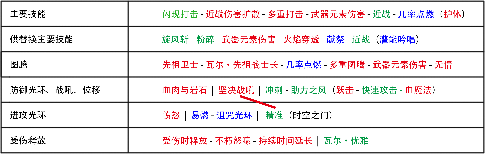

# 侠客 闪现打击

*原文地址：https://www.pathofexile.com/forum/view-thread/2839382*

## BD梗概

闪打自设计之初就充满乐趣，清图效率极高，深受大家的喜爱。在3.10版本我平均每小时跑3EX的收益，在特定地图获得大量梦魇碎片。在3.11，我使用纯物理的闪打在独狼区成功升到100级。

T16：https://www.youtube.com/watch?v=TB1gFj1Y4tE

牛头：https://www.youtube.com/watch?v=ajebFHOffJE

以上是穿着总价值80-100E的装备的刷图影片，你也可以选择用20E的投入达到一半的输出（牛头8-10秒击杀）。其次，在庄园赛季我们可以自己打造非常破格的装备，这对于我们这个bd来说收益巨大。该BD生存能力尚可——我们可以仅穿白袍刷T16的图，但是要注意某些地图词缀。

2E投入，Lv90：https://pastebin.com/PK7gG86F （5400HP，180W输出）

20E投入，Lv95：https://pastebin.com/ngkWYsrR（5900HP，塑界者400W输出）

120E投入，Lv98：https://pastebin.com/xx2GAfBF （6100HP，塑界者1300W输出）

庄园赛季豪华配置：https://pastebin.com/S6GNv2YD（6100HP，塑界者2000W输出）

## 优缺点

### 优点

- 清图速度快，得益于闪打的独特机制以及120%移速的增益效果。
- 5500+血量，96%物理减伤，50%法术减伤
- 高额输出
- 不需要大量投资就可游玩所有游戏内容
- 玩起来十分有趣，仅需按住技能键位不放手
- 凭借强大的防御能力以及尸体毁灭，在所有bd中鹤立鸡群。可以站撸boss，合成怪，跳进30+刺刺鸟群中也不会暴毙。
- 小猎首效果
- 并不是主流流派，因此装备不会贵的太离谱

我并不会牺牲防御来增加DPS——该bd兼备刷图效率，防御力以及单体输出，带着你在地图中闪电般穿梭。

### 缺点

- 必须适应闪打的攻击机制，要忍受一些不便利之处（频繁闪烁，可能同步断线，跳进致命区域导致偶然性死亡）。在创建角色之前先确定这种风格是否适合你，可以先玩个低级的4L版本来试试。
- 面对DOT伤害比较疲软（毒池，燃烧地面等），你需要手动规避这些伤害。
- 并不是最佳的击杀boss技能——闪打的机制使你无法走位闪避伤害，面对终局boss（希鲁斯，终极长老）时可能需要更换为旋风斩来应对。尽管如此，你仍然可以用闪打站撸绝大多数的地图boss、征服者、塑界守卫。
- 单体DPS需要一些在装备上的投资进行提升，身着入门级装备需要20~30秒来击杀T16地图的boss，而20E左右的装备则不超过10秒。

## BD预算与需求

该bd伤害类型为近战火焰伤害，伤害主要来自于【欧罗的贡品】双手剑（火剑）与【隐逝】项链，这是唯二绑定的暗金装备。

6L火剑不到2E就可购入，基本黄装配置就可以畅游T16。

优秀的黄装、星团珠宝、甚至势力装备，最后我们的预算将会来到100E。因此这并不是一个开荒BD，你需要谨慎地升级你的装备。本BD假设你具有相当的游戏知识，懂得如何使用POB以及围绕POB来进行调整。

如果你磕磕绊绊地到了90级，在红图中表现不佳——那这个bd就是为了你而设计的。闪打可以让你以低廉的价格速刷T16地图（2-5ex）。

**3.11 SSF**：火剑在独狼区显然不是一个良好的选择（不易获取），但如果你还是决定使用闪打作为主要技能，在庄园赛季强大的种子工艺的加持下，不妨来试试纯物理流闪打。这是我的角色配置 [Nurya SSF](https://www.pathofexile.com/account/view-profile/Heinarc/characters?characterName=Nurya_SSF)，已经通过了觉醒8T19、长老、塑界者，并且达到了100级。

## 天赋

快速浏览天赋树分布，具体装备与技能机制请见下文

## 技能连法

## BD体系

### 闪打是如何运作的？

> 闪现打击 - 近战伤害扩散 - 多重打击 - 武器元素伤害 - 近战 - 几率点燃
>
> 闪现打击：传送至目标怪物身边并用近战武器对其造成伤害。若是未选定目标，则系统会为其随机指定一只怪物。获得一个增益效果，使移动速度提高一段时间。消耗一个狂怒球能重置其技能冷却。

【近战伤害扩散】以及【多重打击】辅以闪打让我们在怪群中反复横跳，以惊人的速度清理整张地图。其余的辅助技能石尽可能地提高技能伤害。

**狂怒球维持手段**：闪打每次作用需要消耗一颗狂怒球来重置冷却时间。我们通过升华天赋与火剑来快速获取狂怒球：击中点燃中的敌人获得一颗狂怒球。由于具有90%+的点燃几率以及【多重打击】辅助下的3连击，狂怒球的数量得以维持——即使面对单个目标。

### 防御能力

#### 闪避

【血肉与岩石】带致盲光环，装备+天赋总计可达到90%+的闪避率（但难以达到95%的上限）。

我推荐天赋【死里逃生】：24%闪避值，8%所有抗性，不错的防御能力堆叠。

#### 双躲

双躲天赋+石英药剂=50%攻击躲避+40%法术躲避。【瓦尔·优雅】可以在10秒内让我们达到双躲的75%上限（连持续时间延长），以防我们在极度危险的情况下暴毙。

#### 物理减伤

3耐力球+石化药剂=30%物理减伤。加上护体的效果，避免一击毙命。

#### 护体

我们一开始可以将闪打连上【护体】辅助来获得护体状态，后期追求火剑的腐化词缀“此物品上的技能石受到10级的护体辅助 ”。在天赋的加持下，护体效果最终会达到24%物理减伤，这使得我们6000的血量变相等于7900血，十分强劲。

#### 血量

虽然我们并没有着重点出大量的血量天赋，但我们会点出许多珠宝孔，且没有使用不带血量的绑定暗金装备，所以挑选带T1/T2的血量的黄装护甲来达到至少5500的血量，当你进入T14以上的地图时我们不希望过低的血量成为暴毙的主要原因。

