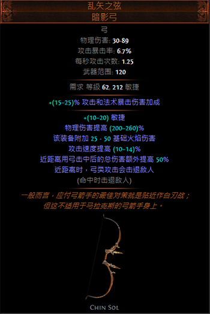
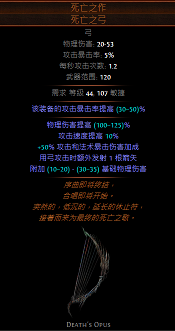
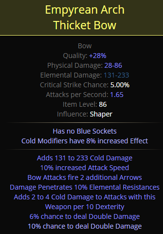
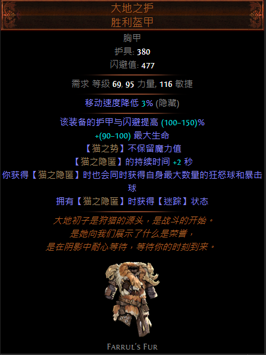
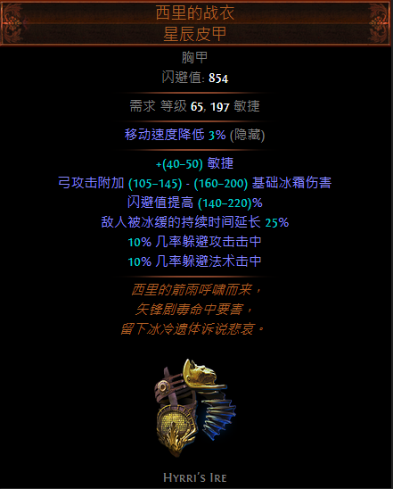

# 锐眼  冰霜射击+弹幕

*原文地址：https://www.pathofexile.com/forum/view-thread/2954336*

## 刷图视频

https://youtu.be/Io5lZ_OB2l0 凤凰 T16

https://youtu.be/0FVK7rhNu3A 牛头 T16

https://youtu.be/yqnYe18spKk 奇美拉 T16

https://youtu.be/kdlPHlqC4BE 督军 kill

https://youtu.be/DGM6Y3b9n4k 狩猎者 A7

https://youtu.be/90suu3-XjhI 塑界者

https://youtu.be/hwlYPbJXFmI 长老

记住，其中的一些视频中还是旧装备，本BD目前为止已经得到了更大的提升。

## 优缺点

#### 优点

- 清图速度惊人
- 在投资后有着优秀的单体输出
- 高移速

#### 缺点

- 装备提升昂贵
- 装备没有配置好容易产生粘稠的手感
- 无法打元反图与无法吸取图

## 伤害机制解读

- 千万不要选择带有【投射物会穿透#个额外目标】基底的箭袋，这会极大地影响连锁作用与AOE效果。
- **弹幕**初始拥有5根箭矢，当你将箭矢数量提高到9-10根时输出将会达到十分可观的水平——大约300K~400K的单根箭矢输出，因此我们的大量伤害来源来自于箭矢数量的增加。
- **寒霜爆**的作用显著，我们只需要-25%的冰霜抗性的效果。
- **狙击者之印**在持久战中可持续对生命药剂进行充能，同时给予dps提升以及AOE效果。
- 如果你手套上有击中附加元素要害的基底，想要同时使用两个诅咒，那么你就需要涂油【灭世之语】来施放额外一个诅咒。

## POB

https://pastebin.com/XLV5GQk0

## 盗贼

帮助阿莉亚

## 万神殿

月影女神+沙之女神

## 升华

聚风 → 狙击 → 无限弹药 → 弹射

## 装备

### 弓

【死亡之作】以及【乱矢之弦】都是不错的主手选择，【死亡之作】额外发射一根箭矢并提升暴击伤害，【乱矢之弦】给予高额inc伤，在有【逝日】药剂的情况下我更推荐【乱矢之弦】。

后期选择塑界底子的林野猎弓（极其昂贵）：

### 手套

#### 擒拿手套

- 生命
- 抗性
- 击中冰缓敌人的伤害提高 (30–50)%

#### 圣战手套

腐化基底选择+1狂怒球上限+击中时附加元素要害诅咒（昂贵）

### 腰带

- 攻击附加元素伤害
- 生命
- 抗性

带【猎首】可达到更快的移动速度

### 头盔

- **智慧（很重要）**
- 生命
- 抗性

选用带【弹幕可以额外发射 1 个投射物】附魔的头盔，如果资金充足，可以进一步制作【周围敌人获得 -9% 冰霜抗性】的救赎者底子的头盔。

如果选用【分形思维】的话，那么你需要补充智慧点数来满足属性需求。

### 胸甲

我个人正在使用【大地之护】，这件衣服可能是游戏中最佳选择，因为可以保持最大数量的狂怒球与暴击球。但如果资金短缺的话，同样可以选择【西里的战衣】。

