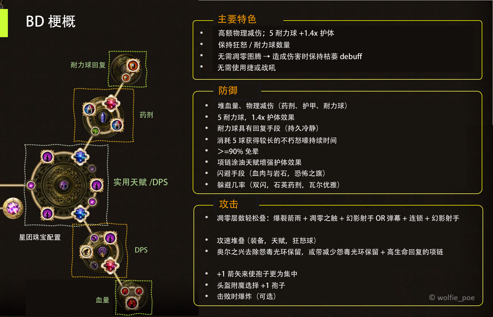
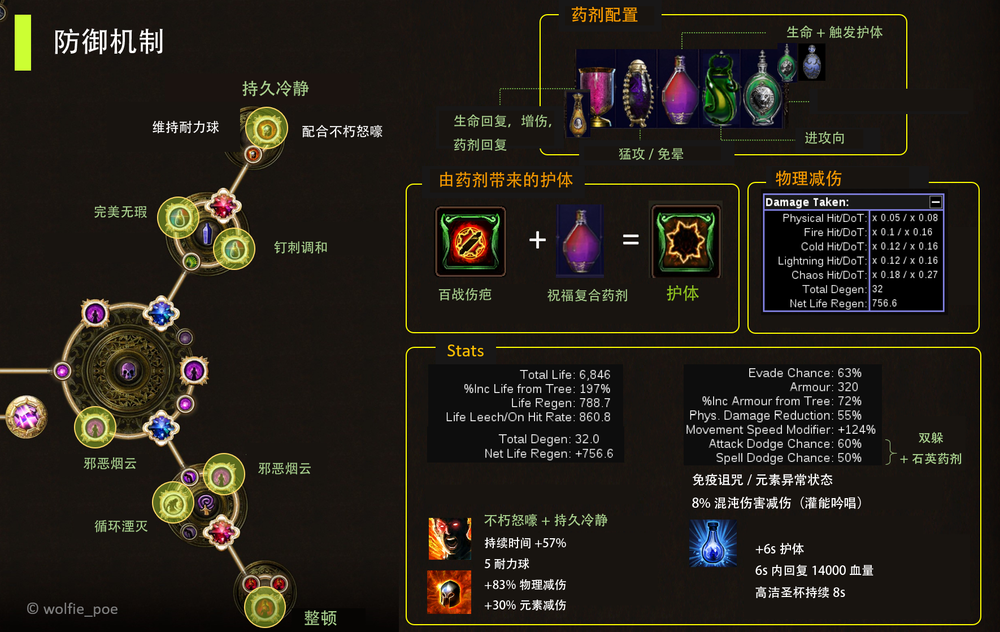
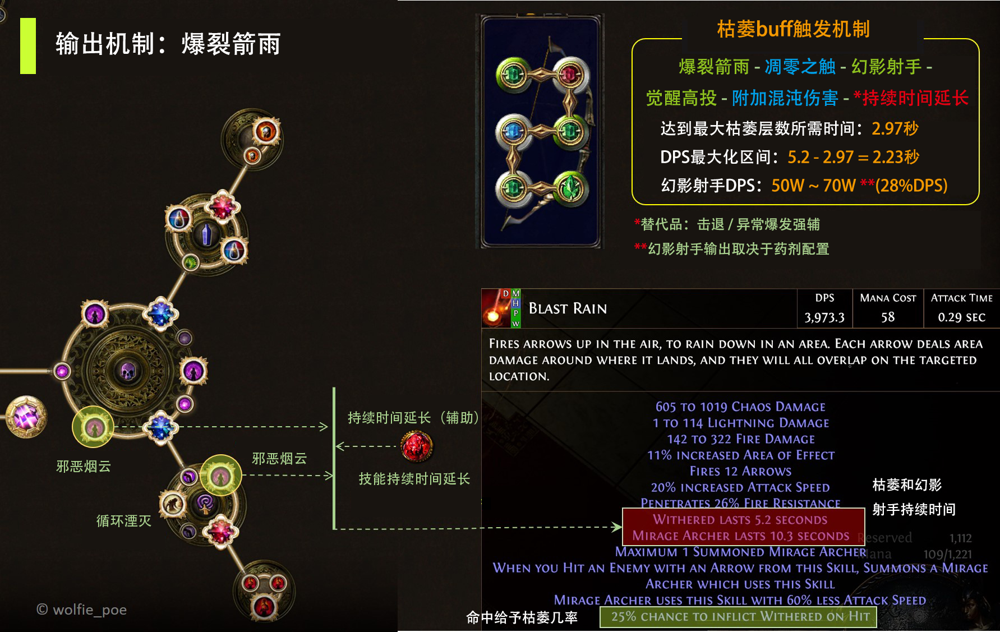
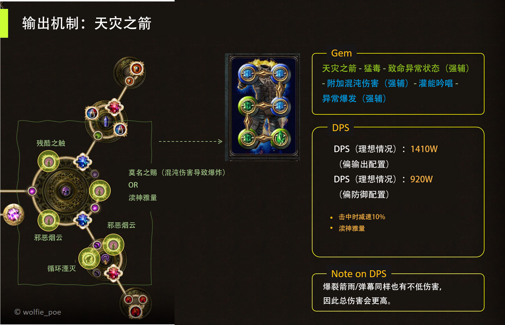
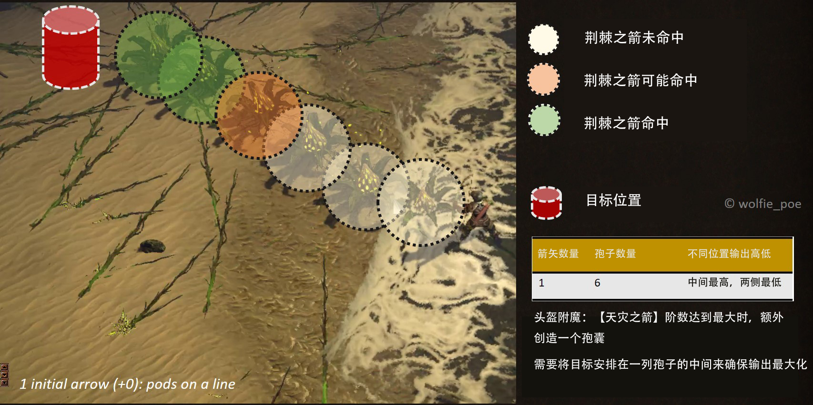
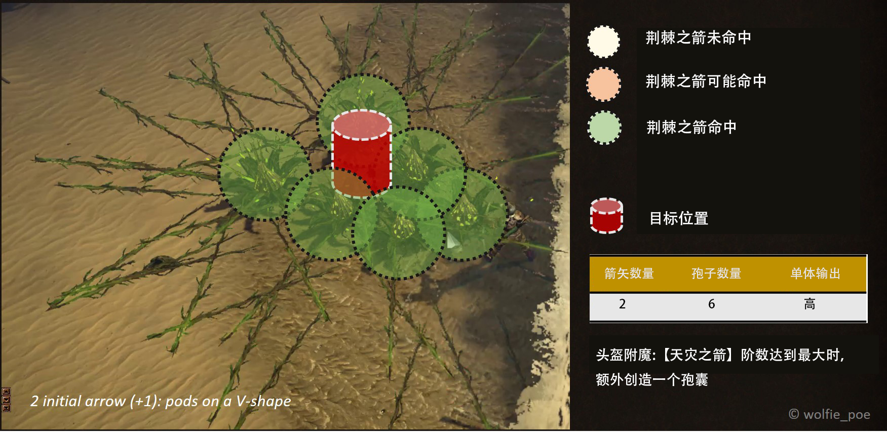
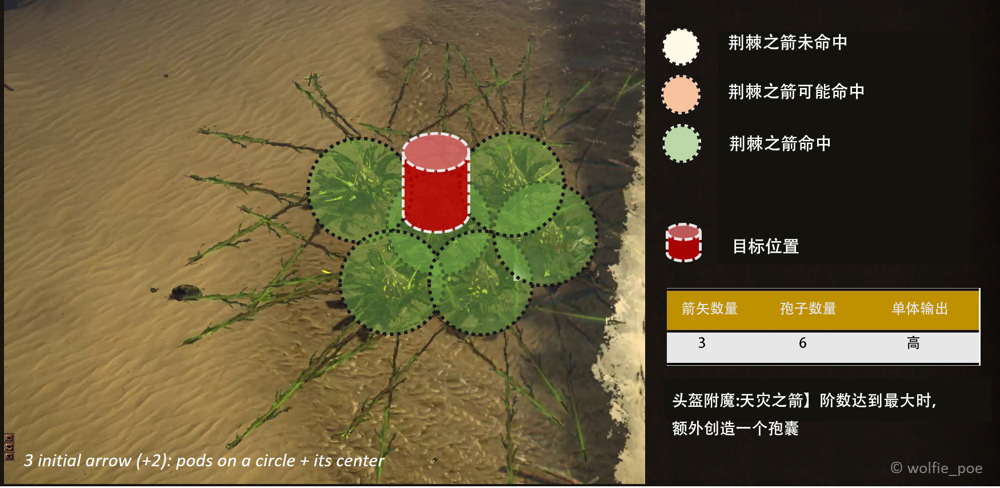
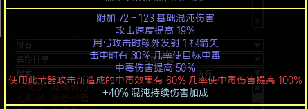
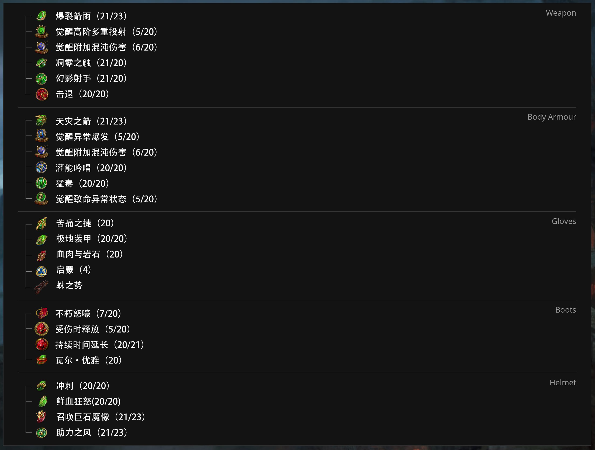

# 追猎者 天灾之箭/毒雨

*原文地址：<https://www.pathofexile.com/forum/view-thread/2851574*>

### *为什么要选择这个BD*

- *游侠里最肉的BD之一 —— 1.4x护体效果，不需要光环或战吼即可达到90%减伤*
- *一种全新的天灾之箭的游玩方式 —— 抛弃使用凋零图腾但仍保持枯萎效果，高DPS值得信赖。*

## boss战表现

站撸卡鲁斯

硬吃塑界者激光和砸地板

硬吃希鲁斯激光、上层女王火圈

## 前言

- 该BD创建了一个肉度极高，且有着高额毒伤的角色。有两种分支可供选择：天灾之箭+爆裂箭雨 / 毒雨+爆裂箭雨，两者都以毒伤为主要输出手段。另外，你也可以选用箭雨+天灾之箭/箭雨+腐蚀箭。
- 本指南致力于提供关于该bd你需要的一切信息：bd结构，装备配置，装备制作，开荒建议等等。乍一看好像很复杂，请把这当做一场旅程，耐心阅读，我认为你最后会有很大的收获。
- 不同阶段的角色配置不同。在初期游戏阶段我们使用便宜的配装，直到中期购入【魔暴之痕】（混沌伤害可造成感电），后期游戏我们可以投入大量资金在一把强力黄装弓（强烈建议）或【夜吟】+【神圣血肉】的组合。本指南提供全面的制装讲解，帮助你平滑地过渡到后期阶段。

## 3.11庄园赛季

 - 在庄园赛季我们的bd表现同样不错，甚至借助庄园工艺更加地强大。所有的配置依旧不变，包括星团珠宝的配置：1进攻性+1防御/药剂。

## 优/缺点

##### 优点：

- 各方面表现均良好
- 清图效率高，单体输出高（在怨毒光环作用下，天灾之箭高达2KW的输出以及300W的爆裂箭雨输出）
- 血量接近7000，不朽怒嚎生效时90%减伤，未生效时71%减伤。
- 持久力强，高额生命秒回；药剂持续时间长；生命药剂回复量高（14000/6s），充能快。
- 所有地图词缀都可以打。
- 可冲100级。
- 专家模式可用。
- 保持高层数的枯萎状态（持续5s）。
- 全面的开荒指南。
- 可用十分廉价的配置（【魔暴之痕】+天灾之箭+箭雨）刷到中期游戏阶段。
- 毕业装备造价比较亲民。
- 不断更新的制装攻略。
- 可以完成终局挑战（满亢奋，T18，T19）。

##### 缺点：

- 需要适应天灾之箭的施放方式。
- 需要频繁使用药剂。
- 你需要深入理解天灾之箭的机制来最大化你的毒伤。

## BD配置

### 机制解读（必读！）

当我们复合药剂生效时，从项链上的涂油天赋【百战伤痕】中获得护体效果。当生命回满时药剂便失效，也会失去护体效果，因此药剂上必须洗出魔力满时药剂效果仍持续的词缀。

不使用多重图腾来触发枯萎buff是因为图腾施法太慢而且在怪群中存活时间太短。爆裂箭雨可以第一时间施放且在目标身上触发枯萎状态，同时附加可观的伤害（T19 DPS40W），配合毒dot伤害十分有效。

所以为什么选爆裂箭雨呢？最重要的一点就是爆裂箭雨可以对同一目标重复攻击，这对枯萎的堆叠来说十分重要，带上高投/觉醒高投，我们一次施放就会有11~12根箭矢，每一根都有25%的几率触发枯萎。所以现在的问题是，我们的枯萎buff是否能堆叠得足够快。

让我们把视线放在另一个目标上：延长枯萎的持续时间。本BD投资了不少在延长技能持续时间上面，最后我们获得近10秒的幻影射手以及5秒的枯萎持续时间，幻影射手攻击时只有本体的40%攻速，因此靠狂怒球、药剂等来弥补攻速的缺口。攻击时我们施放一次爆裂箭雨，后续的攻击由幻影射手完成，枯萎持续时间内足以让我们完成单体目标击杀（征服者，合成怪，梦魇首领）。

天灾之箭的标准配备，强辅技能石能上更好，但在赛季初期，一般辅助技能石即可。

### 天灾之箭的机制以及单体伤害

如果你想要进一步了解天灾之箭的伤害机制，又或者你对自己的单体输出有疑惑，那请仔细阅读本部分内容。

> 天灾之箭  ——  攻击, 投射物, 持续吟唱, 混沌, 弓箭
>
> 通过吟唱给一支箭矢灌注混沌能量，可以蓄力积累阶数。将其发射后，飞行轨迹上会投下孢囊。每个孢囊都会绽放，喷射荆棘之箭，飞行一小段时间后消失。产生额外投射物的词缀只可以影响最初的箭矢数量，产生的孢囊会由它们分担。

这里有一个重点，孢子喷射的荆棘之箭不能同时命中同一目标，因为这些箭是同时射出的。

> 所有投射物与箭矢的特征相同。同一时间发射的多重投射物无法命中同一目标，但伤害的影响效果是可以叠加的，可以在同一目标上造成多个持续伤害效果。许多技能由此得到平衡修正，所以高阶多重投射物并不是必需的，我们就可以更好地调整投射物技能的配备。之前由于散弹效应的存在，一些技能我们原先并不会考虑使用，而现在则得以运用。值得一提的是，近战角色因此也不会受到怪物多重投射物叠加的巨额伤害。

所以对于目标的伤害取决于孢子的数量及位置。

综上所述，头盔附魔我推荐*<u>【天灾之箭】阶数达到最大时，额外创造一个孢囊</u>*，对于天灾之箭伤害提升最大。

一根箭矢：

两根箭矢：

三根箭矢：

## POB

- 毒雨：https://pastebin.com/VEBFyZSN

- 天灾之箭：https://pastebin.com/XZd4cHgp 

- 弹幕+腐蚀箭：https://pastebin.com/wCz65W3f

- 最终毕业版本：https://pastebin.com/f8q2dFhK

- 廉价版本： https://pastebin.com/MsmzBReA

  

## 升华天赋

按照以下顺序来点追猎者的升华天赋：

1. 自然的恩赐 — 自动获得药剂充能
2. 大自然的复仇 — 提高输出
3. 炼金术大师 — 免疫元素异常状态
4. 制毒宗师 — DPS

#### 解读：

【大自然的肾上腺素】看上去增伤效果不错，但【炼金术大师】可免疫元素异常状态，解放药剂词缀位置，这在刷图过程中显然是比前者来的更好。

在【炼金术大师】下你不用担心陷入元素异常状态的麻烦之中，尤其是在面对觉醒等级8的Sirus时。

**不管身处哪一个赛季，请选择【炼金术大师】而非【大自然的肾上腺素】。**

## 盗贼

全杀

## 装备选择

### 涂油

只有一种选择——【百战伤疤】：护体效果大大加强我们的生存能力（金+黑+水蓝）

### 药剂

- 【克拉里多之名】：增伤药剂
- 【高洁圣杯】：生效时双倍获得其他药剂充能数，生命回复大幅增加，boss战时尤为好用。
- 【祝福复合药剂】：生命药剂生效时获得护体效果，但生命药剂在生命回复满时便不再生效，因此我们选用复合药剂带【魔力全满时不会移除药剂效果】的词缀，来保证护体效果的长时间持续。
- 【石化药剂】：物理减伤+免疫诅咒。可以选用增加效果但缩短持续时间的词缀来进一步提升减伤能力，天赋树上有许多药剂持续时间增加的点，不用担心药剂持续时间过短的问题。免疫诅咒也很重要，通常人们会轻视诅咒的效果，但我们不会。
- 【灰烬之瓮】：击杀回复3%最大生命值+几率免晕
- 【逝日】：+2投射物（药剂增强天赋下+3投射物）。有助于扩大射击的覆盖面，并且直伤相对于荆棘箭来说输出更高、范围更大。火焰伤害减伤同样有用，用带【受到的物理伤害转换为火焰伤害】的胸甲时防御更加有效。
- 【石英药剂】：词缀选用【持续时间缩短，效果提高】与免疫诅咒。总共提供15%的双躲几率，让你在穿越怪群时安全无虞，我在98~100级的升级过程中常使用加移速的石化药剂与免疫诅咒的石英诅咒。
- 【瓶中信仰】：三倍的奉献地面范围，怪物承受more伤害，虽然价格略高，但是投资这瓶药绝对是稳赚不赔。当然这只是备选项，并非必需品。
- 【恨意】：搭配头盔上的【受到的物理伤害转换为冰霜伤害】更佳，可替换【高洁圣杯】。
- 【水银药剂】：在庄园赛季中，采用水银药剂来跑图更为舒适，在面对庄园boss时可能会稍微危险一些。

不管你选择何种搭配，尽量使用辛迪加工艺让你的药剂具有26品质。

### 星团珠宝

【持久冷静】是我们的耐力球的来源。受到攻击时每秒+1耐力球，当处于最大耐力球时，受到攻击会刷新充能状态，这实际上给我们带来了半永久性的最大耐力球数。

不光是耐力球带来的减伤效果，【不朽怒嚎】消耗耐力球增加更多的减伤效果（消耗4耐力球获得71%物理减伤），延长效果后最多可达3.5秒持续时间。

值得一提的是，【不朽怒嚎】持续期间，耐力球同样可以获得，因此我们的防御能力十分可靠。

> 庄园赛季中我们可以把【持久冷静】的效果转移到督军底子的胸甲上，而胸甲上其他的词缀也十分方便地制作，小型星团珠宝可换做增加更多血量的天赋。

【自然之喜】增加天赋【造化自然】，总计在5秒内获得10%减伤。该天赋看上去不容易叠加层数，但我们静止使用天灾之箭蓄力时，的确是方便叠层的。我建议当你的血量充足时再使用这颗星团珠宝，来替换增加血量的小型星团珠宝。

我们的星团珠宝配置有两个目标：延长技能效果持续时间（枯萎、幻影射手）+药剂持续时间/充能（护体持续时间延长），具体天赋如下：

- 邪恶烟云、循环湮灭：攻守兼备
- 残酷之触：被“阻碍”的敌人减速30%，这意味着它们更难接触到你，可以轻松地消灭它们，并且被阻碍的敌人承伤增加10%。
- 莫名之赐：毒伤连锁爆炸，配合幻影射手可以快速清图。如果你的单体伤害不够，或打一些终局boss，可换成【渎神雅量】。
- 钉刺调和、完美无暇：提高药剂回复、延长药剂持续时间，配合升华天赋我们会获得长达6秒的护体持续时间。
- 整顿：更多血量！

### 武器/护甲

**弓**：【夜吟】廉价且可通关游戏。后期更换黄装版本：

- 当你有些积蓄后，用神圣石把夜吟的【命中值提高#%】尽量洗满，这样我们就不需要开【精准】光环。
- 利用辛迪加工艺把武器品质提升到28%，黄装版本可利用化石达到更高。

**头盔**：制装过程查看下文

- 附魔选用”【天灾之箭】阶数达到最大时，额外创造一个孢囊“，不用担心头盔的价格，一般带该附魔的头盔C价即可购入。
- 高生命
- 空一个后缀来上工艺【专注时造成的异常状态持续时间延长】，每16秒获得4秒持续时间。
- 救赎词缀【受到击中物理伤害的#%转化为冰霜伤害】

**箭袋**：箭袋应该着重在攻击型词缀上

- +1箭矢（塑界/督军）
- 混沌持续伤害（猎人）
- 命中值（如果你的命中值不够）
- 血量
- 毒伤（猎人）
- 混沌抗性

**胸甲**：

- 【插槽内攻击技能的总魔力消耗 -15】：这是必要的词缀，可使天灾之箭的魔耗减为0，我们可开更多的光环（血肉与岩石、恐怖之旗）。
- 击中时几率获得狂怒球：boss战时十分有效，狂怒球提高攻速→天灾之箭蓄力时间缩短→更高DPS+生存力
- 血量
- 插槽内辅助技能石等级+1，十分难制作
- 受到击中物理伤害的 #% 转化为冰霜/火焰伤害（救赎/督军）

**手套**：【暗夜织礼】瓦尔基底为击中附加【诅咒】是最佳选择，这个暗金手套提供的大量的毒伤inc、些许血量，蛛之势光环可与【残酷之触】相互配合，【入殓师】同样也是不错的选择，如果你瓦不出诅咒基底也没关系，戒指上也可以获得击中附加绝望诅咒的效果。

**项链**：

- T1血量
- 智慧（该bd需要不少智慧点数）
- 抗性
- 可选用生命回复的底子
- +1混沌技能石等级（猎人）
- 混沌持续伤害（猎人）

**戒指1**：【乡愁之环】

- 增加混沌伤害
- 混沌抗性
- 基底选择血量

**戒指2**：第二个戒指更好的选择应是黄装戒指而不是【乡愁之环】，黄装戒指尤其在防御部分更加来的灵活（再次强调生存大于攻击）。

- 血量
- 抗性
- 命中值

**鞋子**：

- 血量
- 30%以上移动速度
- 你造成的中毒的伤害生效速度加快（猎人）
- 混沌抗性

**腰带**：

- 血量
- 药剂相关词缀（持续时间，减少使用充能数）

### 技能连法

tips：

- 爆裂箭雨：【击退】辅助对于天灾之箭很有帮助，因为你需要静止不动来吟唱，当前赛季如果刷图威胁不大的话，用【持续时间延长】/【快速攻击】/【觉醒虚空操纵】来替换也是可以的。
- 光环与捷：如果你有4级启蒙，就可以用【极地装甲】来替换【恐怖之旗】来获得更多的物理/火焰减伤。
- 召唤巨石魔像：可选项。你可以用其他技能如【凋零步】来替换，也可以额外连一颗【肉盾】辅助来令魔像生存性更强。

### 万神殿

月影女神之魂：根据周围敌人数量获得最多8%的减伤。

图克哈玛之魂：静止时最多8%减伤，2%生命回复，我们使用天灾之箭时十分契合该天赋。

