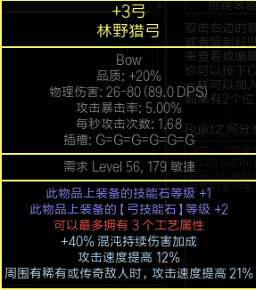
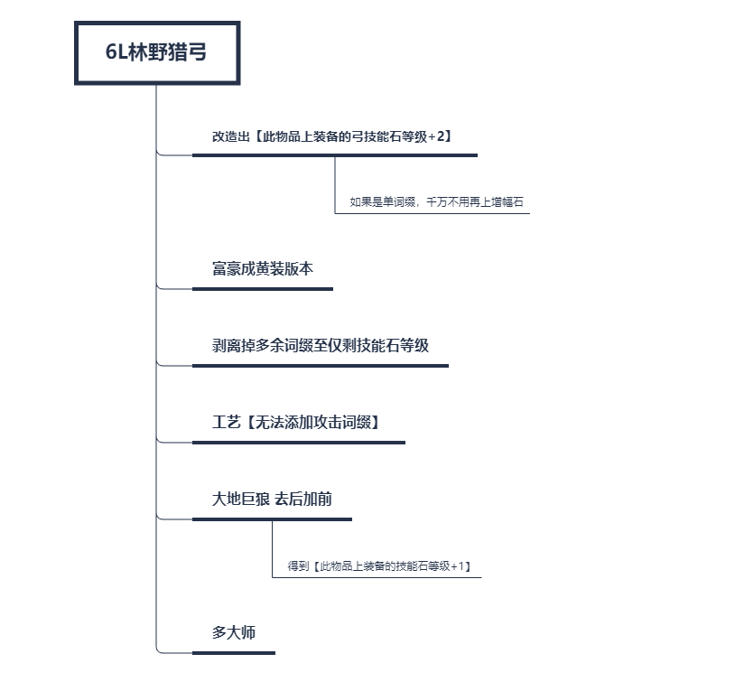
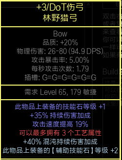
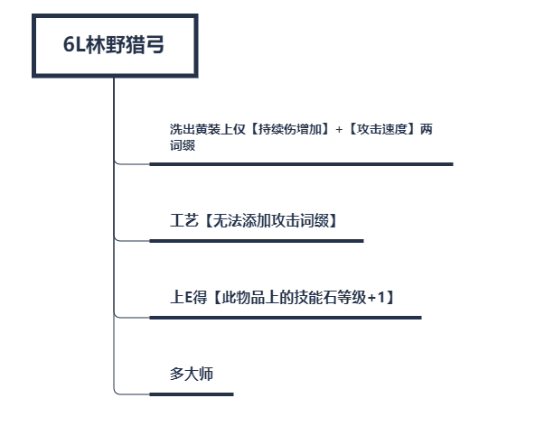

# 欺诈 毒雨+腐蚀箭

*原文地址：https://www.pathofexile.com/forum/view-thread/2467666*

## 3.11改动

3.11中毒雨并没有直接改动，然而天赋树上变动不小，星团珠宝部分天赋遭到了一定的削弱，类似五捷靠叠加天赋效果达到高额属性的玩法被大砍，并且更难roll出理想词缀。因此我们在能负担地起词缀搭配不错的星团珠宝之前，需要另需他路。

## BOSS战表现

### 8觉希鲁斯

https://www.youtube.com/watch?v=fqUxcPZJlb0

### T16

https://www.youtube.com/watch?v=FUj0eSfes90

### 塑界者

https://www.youtube.com/watch?v=XcD23cbP4NE

### T18

https://www.youtube.com/watch?v=7oSKRkt2tDg

## 优缺点

### 优点

- 可以打任何词缀的地图
- 高护盾，高闪避，高躲避
- 伤害可观
- 廉价

### 缺点

- DOT伤害作用较慢
- 一些人不喜欢双技能的玩法

## POB

### 标准配置

https://pastebin.com/9rgZEPya

### 入门配置（无星团珠宝）

https://pastebin.com/npZEsFmp

### 单星团珠宝

https://pastebin.com/ZP5tw3LX

### 双星团珠宝+希望之线

https://pastebin.com/wPhukT5Z

## 升华天赋

有耐心的死神 → 以太行者 → 幽灵舞步 → 逃脱艺术

## 盗贼

全杀

## 万神殿

全凭个人喜好，我的配置是阿拉卡力之魂+拉克丝之魂来减少持续伤害

## 装备

最首要的目的是魔力要保持在一个良好的水平，如果魔力不够，投资瓦尔·优雅/技能减魔耗的词缀/带清晰的三相珠宝。绝大多数情况下魔力不成问题，但是没有魔力回复有时候刷图会略显不流畅，这时候请交给幻影射手来carry你。

一般来说，你50%以上的投资应着眼在弓上，这是你的输出的主要来源。

尽可能早地入手【阿茲里的金履】，之后购入【谜容】、高roll【森林之后】或不错的黄装，这些装备随时都可以低廉的价格购置。

接下来要关注魔力消耗，调整好装备上的魔力消耗相关词缀，把抗性撑到上限，血量/护盾值提升到一个刷图时感觉舒适的水平。

中后期装备往高血量/护盾，更高魔力消耗减少，更多伤害方向努力，持续提升你的装备水准。

### 弓

你可能会需要一把副手弓来放置腐蚀箭6L，但这并不是必需的，你也可以用毒雨来刷图。

入门版本选用1.5攻速的底子，带弓技能石+2/攻速词缀，其余词缀选用取决于你的预算。

#### +3弓：

这把弓相当地好做，具体步骤如下：

#### +3/DoT伤弓：

制作步骤：

### 箭袋

前期箭袋用来补充血量、攻速、抗性，副手使用穿射箭袋来进一步增强腐蚀箭的清图效率。后期当你有了更多的预算时，追求带混沌持续伤/持续伤的箭袋。

